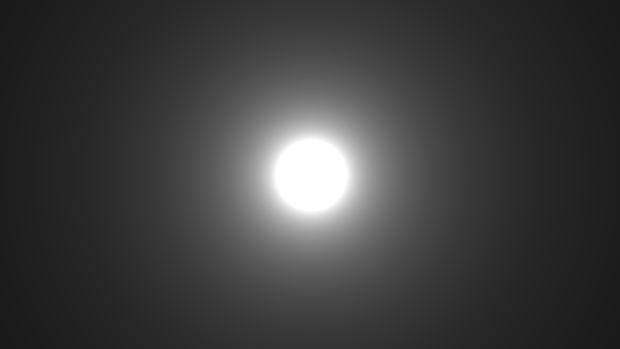
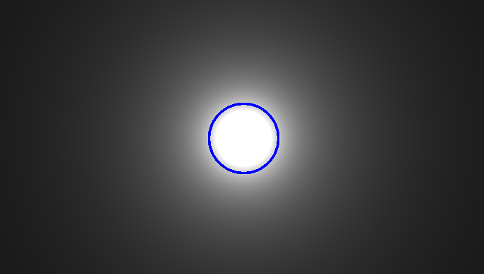
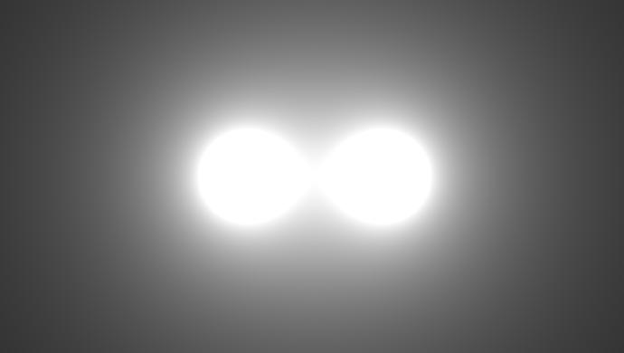
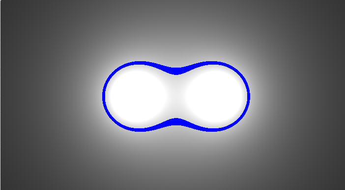

**Metaballs are blobby objects that "glue togheter" when they came close. Were Invented by Jim Blinn for the 1980 documentary TV show Cosmos to represent atoms and molecules. 
Then metaballs became a popular effect in the demoscene in the early 90s. In this article we'll see how render them in 2D.**


{}
In this page you'll find shaders written with [Shadertoy](https://shadertoy.com/ "ShaderToy") and [Desmos](https://desmos.com/ "Desmos") graphs. 
[Read how to use the interactive content in this site](/post/howto-interactive-content).
{}

 If you're curious, there is a link in the References section to the original episode of <cite>Cosmos [^1]</cite> where the metaballs where used for the first time.
[^1]: Cosmos Ep. 2. https://youtu.be/SYpYB2f9kGk?t=2419. To give an idea what we are talking about, the following is an example implementations I made in ShaderToy:

2D Metaballs |
--------|
	<iframe width="100%" height="460" frameborder="0" src="https://www.shadertoy.com/embed/3s3yWf?gui=true&t=10&paused=false&muted=false" allowfullscreen></iframe>

<br />

## Isolines of a scalar field 
Figure 1 shows the output of the following function of two variables:

$$f(x,y) = \frac{1}{r}$$ 

where r is the **distance from the orgin**, computed as $r=\sqrt{x^2+y^2}$. The higher values are the brighter pixels, that become darker as the distance from $(0,0)$ increase.
The output of such function it's called a **scalar field**. 

<br />

One scalar field | The metaball |Two fields summed | The metaball
--------|-|-|-
 |  |  |  

Now we can already give the definition:

>*The metaball is the portion of the scalar field where the values are above a threshold.*

In Figure 2 the blue pixels have a value equal to the threshold. The blue line is called an **isoline** and all the pixel **inside the isolines** are the metaball.

**Translating** the function on the left and adding another equal on its right (Figure 3), generates a scalar field that is the **sum of both**, and a new isoline.

Moving one function respect to the other will make the isolines change continuously, and "glue togheter" when they came close, as shown in the following shader:

<p><iframe width="100%" height="360" frameborder="0" src="https://www.shadertoy.com/embed/7tGyDR?gui=true&t=10&paused=false&muted=false" allowfullscreen></iframe><p/>

Changing the threshold will make the isolines "bigger" or "smaller". 

<br />

## The falloff function
$f(x,y) = \frac{1}{r}$ is **inversely proportional** to the distance from the origin. For this reason we'll call it the **falloff**.

This particular function isn't the best choiche for some reasons:

* it's $+\infty$ in the origin, so we have to **clamp** it
* uses a **division** that is expensive (at least on old hardware :))
* never became zero, so we have always sum up all the functions to compute the field, no matter how far

The following Desmos graph shows some falloff in one dimension, as function of the distance from the origin $r$. In *red* the previous one and in **blue** the clamped version.

Actually we will use the **green** one, the **cubic polynomial** $f(r) = 1-(3r^2-2r^3)$. $(3r^2-2r^3)$ is also known as the **smoothstep** function.

<p><iframe src="https://www.desmos.com/calculator/xllx6tmhdx" width="100%" height="300" style="border: 1px solid #ccc" frameborder=0></iframe></p>
	
Using the cubic we can ignore functions that are farther than the falloff lenght, avoid division and any discontinuity.

The lenght of the falloff can be changed multipling the falloff argument for a value $a>0$ to increase the size of the metaballs, or $a<0$ to decrease it. (i.e. computing $f(\frac{r}{a})$);

<br />

## ShaderToy code 
Finally this is the code that implements the previous shader, you can also click on the shader title and make your experiments in ShaderToy, and see the results in real time.
I added some comments that explain the code in detail.

```glsl
// This function is called for each pixel
void mainImage( out vec4 fragColor, in vec2 fragCoord)
{
    // Coordinated of the current pixel
    float x = fragCoord.x;
    float y = fragCoord.y;
    
    // In ShaderToy the point (0,0) is the bottom left angle,
    // but we want (0,0) at the center of the screen so translate it there.
    vec2 Coord = (2.*fragCoord-iResolution.xy) / iResolution.y;
    
    // Scale up coordinates a little bit (zoom out)
    Coord = Coord * 5.; 
    
    // Define the position of the two scalar fields
    vec2 CHARGES_1_POS = vec2(2,0);
    vec2 CHARGES_2_POS = vec2(-2,0);
    
    // Compute the first field value for this pixel 
    float f1=0.;
    CHARGES_1_POS.x *= 3.*sin(iTime);   // Move one of the two charges at each frame
    float r1 = length(CHARGES_1_POS - Coord);
    if(r1>3.) f1 = 0.;                  // Ouside the falloff, do not evaluate the function
    f1 = 1.-smoothstep(0.,3.,r1); // Using 1-3x^2 - 2x^3 as falloff, that goes from 0 to 1 when r goes from 0 to 3 (scaled a little bit)
    
    // Compute the second field value for this pixel 
    float f2=0.;
    float r2 = length(CHARGES_2_POS - Coord);
    if(r2>3.) f2 = 0.;                       // Ouside the falloff, do not evaluate the function
    else f2 = 1.-smoothstep(0.,3.,r2); // Using 1-3x^2 - 2x^3 as falloff, that goes from 0 to 1 when r goes from 0 to 3 (scaled a little bit) 
    
    // Compute the sum of all fields
    float fTotal = f1 + f2;
    
    // The surface of the metaball will be defined for the values less then 0.8.
    // We'll show the isoline fTotal = 0.3, rendering the pixel that has
    // fTotal value "near" 0.3 in blue
    if(abs(fTotal-0.4) < 0.03)
    {
        fragColor = vec4(0,0,1,1);    
    }
    else 
    {
        fragColor = vec4(fTotal);
    }
}
```

<br />


## Experiment

Now that we know the base effect, it's possible to add variations. 

More fields and movements:

<iframe width="100%" height="360" frameborder="0" src="https://www.shadertoy.com/embed/slVyzw?gui=true&t=10&paused=false&muted=false" allowfullscreen></iframe> 

Or colors:
	
<iframe width="100%" height="360" frameborder="0" src="https://www.shadertoy.com/embed/3s3yWf?gui=true&t=10&paused=false&muted=false" allowfullscreen></iframe> 

You can even experiment changing the falloff function. And more ...

<br />

*This is all for the 2D metaballs, in the next article we'll se how to render 3D metaballs !! See you soon.*

<script>
    document.addEventListener("DOMContentLoaded", function() {
        renderMathInElement(document.body, {
            delimiters: [
                {left: "$$", right: "$$", display: true},
                {left: "$", right: "$", display: false}
            ]
        });
    });
</script>
